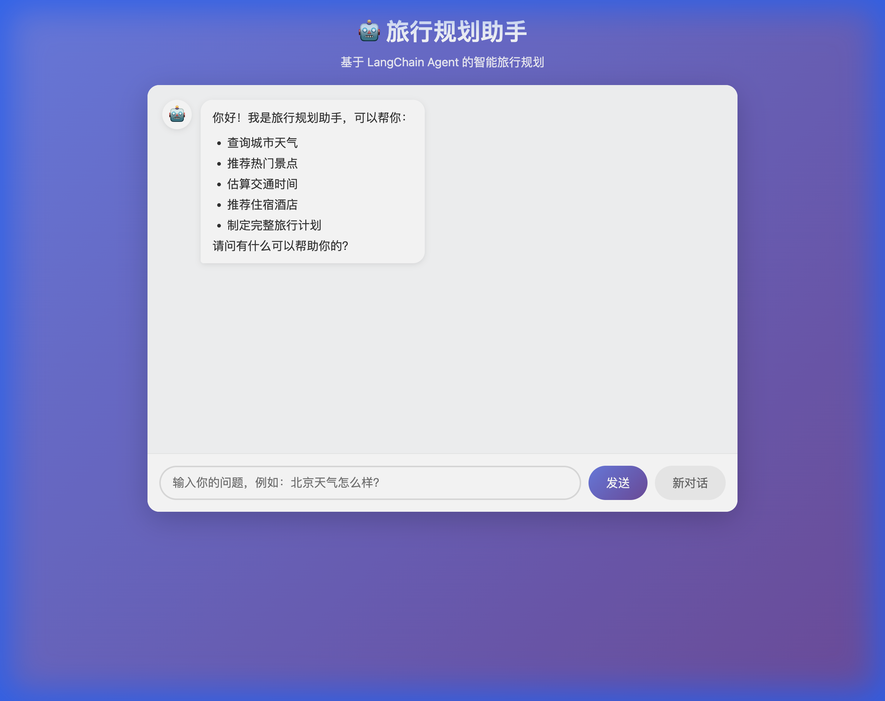
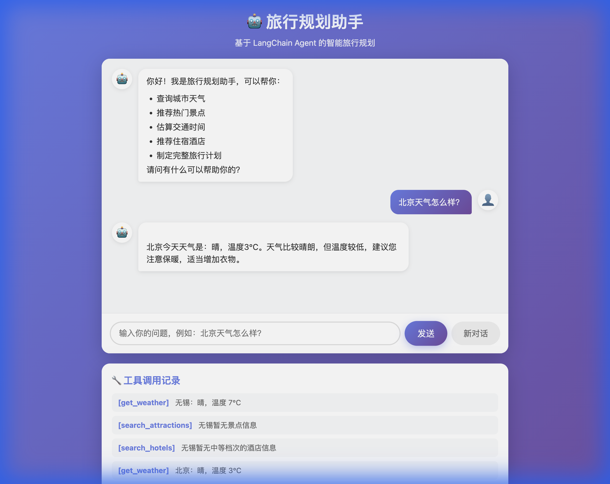

# 第五课：构建完整的 Agent 应用

## 1. 回顾

前四课我们学习了：
- Agent 基础概念和工具定义
- 调用真实 API（心知天气）
- 记忆与多轮对话
- 多步骤复杂任务

本节课我们将把 Agent 打包成一个 **完整的 Web 应用**！

---

## 2. 最终效果

启动应用后，打开浏览器即可与 Agent 对话：



与 Agent 对话的效果：



---

## 3. 应用架构

```
┌─────────────────────────────────────────────┐
│                  Web 界面                    │
│         (HTML + CSS + JavaScript)           │
└─────────────────────┬───────────────────────┘
                      │ HTTP 请求
                      ▼
┌─────────────────────────────────────────────┐
│                Flask 服务器                  │
│              (Python 后端)                   │
└─────────────────────┬───────────────────────┘
                      │ 调用
                      ▼
┌─────────────────────────────────────────────┐
│              LangChain Agent                │
│         (工具 + LLM + 记忆)                  │
└─────────────────────────────────────────────┘
```

---

## 4. 技术栈

| 组件 | 技术 | 用途 |
|------|------|------|
| 后端 | Flask | 提供 API 接口 |
| 前端 | HTML/CSS/JS | 用户界面 |
| Agent | LangChain | 智能对话 |
| 通信 | REST API | 前后端交互 |

---

## 5. 项目结构

```
lesson05/
├── app.py              # Flask 主程序
├── agent.py            # Agent 定义
├── templates/
│   └── index.html      # 前端页面
├── static/
│   ├── style.css       # 样式文件
│   ├── app_demo.png    # 应用截图
│   └── chat_demo.png   # 对话截图
├── run.sh              # 启动脚本
└── requirements.txt    # 依赖
```

---

## 6. 核心代码

### 6.1 Agent 模块 (agent.py)

```python
from langchain_community.chat_models import ChatZhipuAI
from langchain_core.tools import tool
from langgraph.prebuilt import create_react_agent
from langgraph.checkpoint.memory import MemorySaver

# 定义工具
@tool
def get_weather(city: str) -> str:
    """查询城市实时天气"""
    # ... 调用心知天气 API

@tool
def search_attractions(city: str) -> str:
    """搜索城市的热门景点"""
    # ... 返回景点信息

# 创建 Agent
def create_agent():
    llm = ChatZhipuAI(model="glm-5.1", api_key=os.getenv("ZHIPU_API_KEY"))
    memory = MemorySaver()
    return create_react_agent(llm, tools, checkpointer=memory)
```

### 6.2 Flask 后端 (app.py)

```python
from flask import Flask, request, jsonify, render_template
from agent import create_agent

app = Flask(__name__)
agent = create_agent()

@app.route('/')
def index():
    return render_template('index.html')

@app.route('/chat', methods=['POST'])
def chat():
    data = request.json
    user_message = data.get('message', '')
    thread_id = data.get('thread_id', 'default')
    
    config = {"configurable": {"thread_id": thread_id}}
    result = agent.invoke(
        {"messages": [{"role": "user", "content": user_message}]},
        config
    )
    
    return jsonify({
        "response": result["messages"][-1].content,
        "thread_id": thread_id
    })

if __name__ == '__main__':
    app.run(debug=True, port=8080)
```

### 6.3 前端页面 (templates/index.html)

```html
<div class="chat-container">
    <div id="messages"></div>
    <input type="text" id="user-input" placeholder="输入消息...">
    <button onclick="sendMessage()">发送</button>
</div>

<script>
async function sendMessage() {
    const input = document.getElementById('user-input');
    const message = input.value;
    
    const response = await fetch('/chat', {
        method: 'POST',
        headers: {'Content-Type': 'application/json'},
        body: JSON.stringify({message: message})
    });
    
    const data = await response.json();
    displayMessage('Agent', data.response);
}
</script>
```

---

## 7. 快速开始

```bash
# 进入课程目录
cd course/lesson05

# 运行应用
./run.sh

# 打开浏览器访问
# http://localhost:8080
```

---

## 8. 功能特点

- ✅ **实时天气查询** - 调用心知天气 API
- ✅ **景点推荐** - 支持多个热门城市
- ✅ **交通估算** - 高铁/飞机时间和费用
- ✅ **酒店推荐** - 经济/中等/高端档次
- ✅ **多轮对话** - 记住上下文
- ✅ **工具调用透明** - 显示 Agent 思考过程

---

## 9. 部署选项

| 方式 | 适用场景 | 难度 |
|------|----------|------|
| 本地运行 | 开发测试 | ⭐ |
| Docker | 容器化部署 | ⭐⭐ |
| 云服务器 | 生产环境 | ⭐⭐⭐ |
| Serverless | 弹性伸缩 | ⭐⭐⭐ |

---

## 10. 课后练习

1. 添加对话历史显示功能
2. 实现多用户支持（不同 thread_id）
3. 添加"清空对话"按钮
4. 尝试部署到云服务器

---

## 课程总结

恭喜你完成了 LangChain Agent 开发课程！🎉

你已经学会了：
- ✅ 第一课：Agent 基础概念
- ✅ 第二课：调用真实 API
- ✅ 第三课：记忆与多轮对话
- ✅ 第四课：复杂任务处理
- ✅ 第五课：构建完整应用

**下一步建议**：
